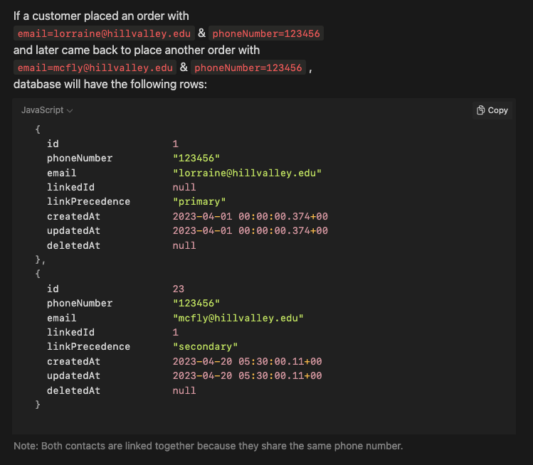
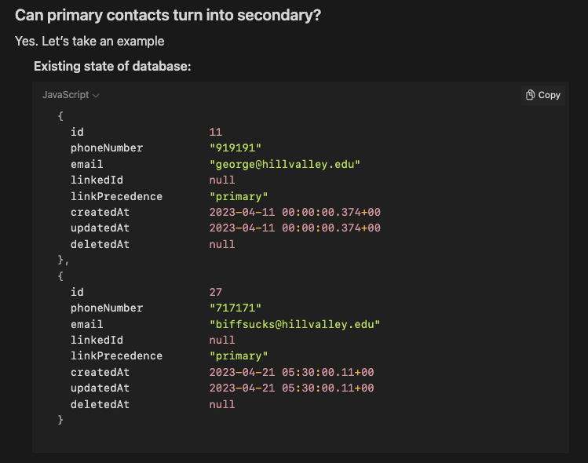

# Identity reconciliation

Job application submission for Bitespeed Backend Task. [Assignment link](https://bitespeed.notion.site/Bitespeed-Backend-Task-Identity-Reconciliation-53392ab01fe149fab989422300423199)

👉🏾 [My resume](/Resume%20-%20Emil%20Sharier.pdf)

## Live endpoint

This REST API is deployed to Netlify functions and the database of choice is Postgres (Supabase). Reason for choosing them is that they have generous free tiers.

Identify POST endpoint - https://identity-reconciliation-test.netlify.app/api/identify

[Postman collection](https://www.postman.com/spacecraft-cosmonaut-73901268/workspace/emil-s-public-workspace/collection/19331350-88a28011-d4c9-442a-8715-b57482ecd56c?action=share&creator=19331350)

## To run locally

---

### Requirements

- Node `>16.0` (Should work in 14, although netlify binaries are recommended to be run on 16 and above)
- Postgres service running (either as a stand-alone process or a docker image)
- `netlify` executable installed. This can be installed with `npm i -g netlify`. The API is deployed as a Netlify function (for demo purposes therefore, you need the netlify binaries to execute the functions). For more information on how the API is hosted and redirected, check out the `netlify.toml` file

---

1. Create a `.env` file that would contains 2 variables as below

```env
DIRECT_URL="postgresql://<postgres_username>:<postgres_password>@localhost:5432/identity-reconciliation?schema=public"

DATABASE_URL="postgresql://<postgres_username>:<postgres_password>@localhost:5432/identity-reconciliation?schema=public"
```

Replace the `postgres_username` with the actual username. Same with the `postgres_password` param in the url

2. Run `netlify dev`. You will receive the localhost run-time to test out the functions. Further testing of the endpoints can be done using Postman or the browser

## POST Endpoints

- ### `/api/seed`

This endpoint is to reset the database and seed the json payload that is shown here



- ### `/api/seed-two`

This endpoint is to reset the database and seed the json payload that is shown here



- ### `/api/identify`
- ### `/api/order`
